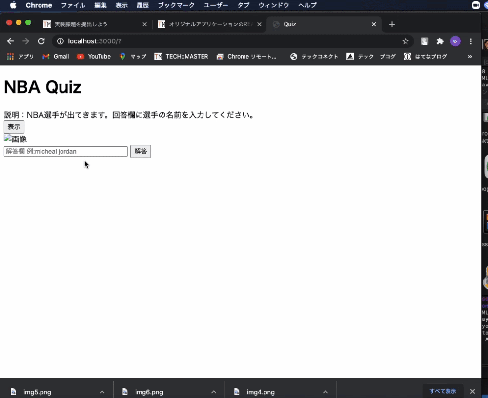

## アプリケーション名	
NBA Quiz
## アプリケーション概要
NBA選手の名前を当てることができます。答えによって正解及び不正解を出力します。
## URL
https://nba-quiz-32125.herokuapp.com/
## 利用方法
1.ページ上の「表示」ボタンを押すと選手の顔が表示されます。
2.表示された選手の名前を入力フォームに記入します。
3.「解答」ボタンを押して、答え合わせします。
## 目指した課題解決
自分のJavascriptの知識を復習したいと思い、作成しました。
## 洗い出した要件
・「表示」ボタンを押すと、ランダムに画像が表示される。
・正解と解答を比べて、出力結界を分岐させる。
## 実装した機能についてのGIFと説明	
①ランダムで画像を表示
②画像にname属性を指定してユーザーの解答と照らし合わせる
③正誤に合わせて正解不正解を出力

## ローカルでの動作方法	 
Ruby 2.6.5, Ruby on rails 6.0.3.4, Javascript, Visual Studio Code,
